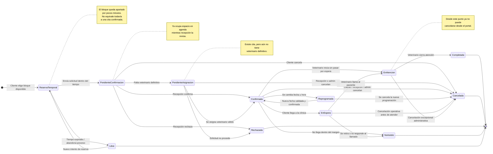

# 🎯 Propósito

Este documento define los requerimientos y la lógica de negocio para un sistema de gestión de citas veterinaria profesional, realista y no excesivamente complejo.

Está pensado para una clínica veterinaria con 1 a 5 veterinarios que necesita digitalizar su operación diaria sin convertirse en un sistema hospitalario avanzado.

**Idea central:** la cita conecta al cliente, la mascota, el veterinario, el servicio, la atención clínica y el pago. Todo el sistema gira alrededor de ese eje.

---

## 👥 Actores del Sistema

| Actor | Descripción | Panel de acceso |
| :--- | :--- | :--- |
| **Cliente** | Dueño o responsable de la mascota | Portal Cliente |
| **Recepcionista** | Gestiona agenda, confirma citas, registra cobros y atiende presencialmente | Panel Operativo |
| **Veterinario** | Atiende mascotas y registra la atención clínica | Panel Veterinario |
| **Administrador** | Configura el sistema y supervisa toda la operación | Panel Administrador |

---

## 🔐 MÓDULO 1 — Autenticación y Acceso

### Descripción
Controla quién puede entrar al sistema, con qué identidad y a qué panel accede según su rol.

### Requerimientos funcionales

* **RF-01 — Registro de cliente (auto-registro)**
  * El cliente puede registrarse desde la web sin necesidad de que la clínica lo cree manualmente.
  * **Datos requeridos:** nombre completo, correo electrónico, contraseña, teléfono.
  * **Datos opcionales:** documento de identidad, dirección.
  * El correo no puede repetirse en el sistema.
  * Al completar el registro, el sistema crea automáticamente una cuenta con rol Cliente.
  * Puede registrar su primera mascota inmediatamente después del registro.

* **RF-02 — Inicio de sesión**
  * Acceso por correo y contraseña.
  * Al autenticarse, el sistema detecta el rol y redirige:
    * Cliente → `/portal-cliente`
    * Recepcionista → `/agenda`
    * Veterinario → `/mi-agenda`
    * Administrador → `/dashboard`
  * Si el usuario intenta acceder a una ruta que no le corresponde, se le deniega el acceso y se le redirige.

* **RF-03 — Gestión de usuarios internos (solo Admin)**
  * El administrador puede crear cuentas para recepcionistas y veterinarios.
  * Puede activar o desactivar cuentas internas sin eliminarlas.
  * No puede eliminar una cuenta si tiene historial de citas o atenciones.

### Reglas de negocio

> 1. Las contraseñas se almacenan siempre con hash seguro. Nunca en texto plano.
> 2. Un usuario desactivado no puede iniciar sesión.
> 3. El sistema no debe revelar si un correo existe o no en el mensaje de error del login.

---

## 👤 MÓDULO 2 — Gestión de Clientes

### Descripción
Un cliente es el responsable administrativo y legal de una o más mascotas. Puede tener acceso digital al portal o existir solo como registro interno de la clínica.

### Requerimientos funcionales

* **RF-04 — Registrar cliente desde recepción**
  * La recepcionista o el administrador pueden crear un cliente manualmente.
  * **Datos requeridos:** nombre completo, teléfono.
  * **Datos opcionales:** documento de identidad, correo electrónico, dirección, observaciones.
  * Si tiene correo, se le puede habilitar acceso al portal posteriormente.

* **RF-05 — Buscar cliente**
  * Búsqueda en tiempo real por nombre, teléfono, documento o correo.
  * Los resultados muestran nombre, teléfono y número de mascotas registradas.

* **RF-06 — Ver ficha del cliente**
  * Muestra datos personales, lista de mascotas, historial de citas y resumen de pagos.

* **RF-07 — Editar datos del cliente**
  * Se pueden actualizar todos los datos de contacto.
  * El historial no se ve afectado por cambios posteriores.

* **RF-08 — Inactivar cliente**
  * Un cliente no se elimina nunca si tiene mascotas o historial.
  * Se marca como inactivo.
  * Un cliente inactivo no puede agendar nuevas citas.

* **RF-09 — Detección de posibles duplicados**
  * Al crear o editar un cliente, el sistema advierte si ya existe otro con el mismo documento, correo o teléfono.
  * La advertencia no fusiona registros automáticamente.
  * La recepcionista o el administrador deciden corregir o continuar.

### Reglas de negocio

> 1. Toda mascota debe tener obligatoriamente un cliente responsable.
> 2. No puede existir un cliente duplicado con el mismo documento o correo.
> 3. Si el cliente no tiene correo registrado, no puede acceder al portal.

---

## 🐾 MÓDULO 3 — Gestión de Mascotas

### Descripción
La mascota es la unidad clínica central del sistema. Todo el historial médico, vacunas, diagnósticos y tratamientos están asociados a ella, no al cliente.

### Requerimientos funcionales

* **RF-10 — Registrar mascota**
  * **Datos requeridos:** nombre, especie (Perro / Gato / Ave / Otro), cliente responsable.
  * **Datos opcionales:** raza, sexo, fecha de nacimiento o edad estimada, peso inicial, color, observaciones generales, alergias conocidas.

* **RF-11 — Ficha completa de la mascota**
  * La ficha muestra en una sola pantalla:
    * Datos generales de la mascota.
    * Nombre del cliente responsable con enlace a su ficha.
    * Próximas citas agendadas.
    * Historial de citas pasadas con fecha, servicio y veterinario.
    * Resumen de atenciones clínicas.
    * Alertas visibles: alergias, condición crónica, última vacuna.

* **RF-12 — Editar datos de la mascota**
  * Se pueden modificar datos generales sin afectar el historial clínico.
  * El peso puede actualizarse en cada atención.

* **RF-13 — Inactivar mascota**
  * Si la mascota fallece, cambia de dueño o deja de asistir, se marca como inactiva.
  * Nunca se elimina si tiene historial clínico.
  * Las citas futuras de una mascota inactivada deben cancelarse automáticamente.

* **RF-14 — Cambiar responsable de la mascota**
  * El sistema permite cambiar el cliente responsable de una mascota.
  * El historial clínico y el historial de citas se conservan íntegros.
  * Debe registrarse quién realizó el cambio y cuándo se hizo.

### Reglas de negocio

> 1. No se puede registrar una mascota sin asociarla a un cliente.
> 2. Una mascota inactiva no puede tener nuevas citas.
> 3. El historial clínico pertenece a la mascota y permanece aunque el cliente cambie.

---

## 🛠️ MÓDULO 4 — Catálogo de Servicios

### Descripción
El catálogo define qué servicios ofrece la clínica, cuánto cuestan y cuánto tiempo ocupan en agenda. Es la base para agendar citas y calcular cobros.

### Requerimientos funcionales

* **RF-15 — Crear servicio**
  * **Datos requeridos:** nombre, duración en minutos, precio base.
  * **Datos opcionales:** descripción, si requiere veterinario asignado o puede ser solo técnico, especialidad requerida.

* **RF-16 — Editar servicio**
  * Se puede modificar nombre, descripción, duración y precio.
  * Los cambios de precio no afectan citas ya registradas.

* **RF-17 — Activar o desactivar servicio**
  * Un servicio desactivado no aparece como opción al agendar.
  * No se elimina si tiene citas históricas asociadas.

* **RF-18 — Listado de servicios**
  * Visible para recepción y administrador.
  * El cliente solo ve los servicios activos al momento de agendar.

### Reglas de negocio

> 1. La duración del servicio se usa para calcular si el horario está disponible.
> 2. El precio base es referencial. El monto final puede ajustarse al cobrar.
> 3. No puede existir dos servicios activos con el mismo nombre.
> 4. Si un servicio requiere especialidad, solo pueden atenderlo veterinarios habilitados para dicha especialidad.

---

## 📅 MÓDULO 5 — Agenda y Gestión de Citas

### Descripción
La agenda es el corazón operativo del sistema. Controla el tiempo de cada veterinario, evita solapamientos y permite que clientes y personal gestionen citas de forma ordenada.

En esta versión, la agenda debe ser clara, funcional y realista para la operación diaria de una clínica veterinaria pequeña.

### Conceptos base

* **Horario de clínica:** horario general de atención del establecimiento.
* **Horario de veterinario:** disponibilidad específica de cada veterinario.
* **Bloque de agenda:** unidad visible de tiempo que el sistema muestra como reservable.
* **Bloqueo manual:** tiempo no disponible por descanso, almuerzo, ausencia o actividad interna.
* **Reserva temporal:** aparta un bloque durante pocos minutos mientras se completa el proceso de solicitud.
* **Pendiente de confirmación:** cita solicitada por el cliente, aún no confirmada por recepción.
* **Pendiente de asignación:** cita registrada sin veterinario definitivo.

### Requerimientos funcionales

* **RF-19 — Configurar horario general de la clínica**
  * El administrador puede definir días y horas de atención.
  * Puede marcar días no laborables.
  * La agenda pública del portal parte de este horario base.

* **RF-20 — Configurar horario por veterinario**
  * El administrador puede definir para cada veterinario:
    * días laborables,
    * hora de inicio,
    * hora de fin,
    * descansos si aplica.

* **RF-21 — Registrar bloqueos manuales de agenda**
  * Recepción o administrador puede bloquear un rango horario de un veterinario.
  * Motivos posibles:
    * almuerzo,
    * descanso,
    * ausencia,
    * reunión,
    * capacitación,
    * procedimiento interno.

* **RF-22 — Ver agenda operativa**
  * La recepcionista, el administrador y el veterinario pueden ver la agenda diaria y semanal.
  * La vista muestra:
    * hora,
    * cliente,
    * mascota,
    * servicio,
    * veterinario,
    * estado.
  * Permite filtrar por fecha, veterinario y estado.

* **RF-23 — Calcular bloques disponibles**
  * El sistema genera bloques disponibles según:
    * horario general de la clínica,
    * horario del veterinario,
    * duración del servicio,
    * citas existentes,
    * bloqueos manuales,
    * estado activo del servicio,
    * estado activo del cliente,
    * estado activo de la mascota.
  * El cliente no puede escribir una hora manualmente.
  * Solo puede elegir bloques que el sistema muestre como válidos.

* **RF-24 — Mostrar disponibilidad en el portal del cliente**
  * El portal muestra un calendario con días disponibles.
  * Al seleccionar un día, muestra únicamente los bloques horarios disponibles.
  * Los horarios no disponibles deben aparecer deshabilitados o no visibles.

* **RF-25 — Reserva temporal del horario**
  * Cuando el cliente selecciona un bloque e inicia la solicitud, el sistema lo aparta temporalmente.
  * La reserva temporal dura 5 minutos.
  * Si el proceso no se completa dentro de ese tiempo, el bloque se libera automáticamente.

* **RF-26 — Solicitar cita desde portal del cliente**
  * Flujo del cliente:
    * selecciona mascota,
    * selecciona servicio,
    * selecciona fecha,
    * selecciona hora disponible,
    * escribe motivo opcional,
    * confirma la solicitud.
  * La cita se registra en estado **Pendiente de confirmación**.
  * La cita pendiente bloquea ese espacio en la agenda.

* **RF-27 — Crear cita desde recepción o administrador**
  * Recepción o administrador pueden registrar una cita directamente.
  * **Datos requeridos:** mascota, servicio, fecha, hora.
  * **Datos opcionales:** veterinario preferido, motivo, canal de origen.
  * Si todo es válido, puede guardarse directamente como **Confirmada**.
  * Si aún no tiene veterinario definitivo, puede quedar **Pendiente de asignación**.

* **RF-28 — Asignar veterinario a la cita**
  * La cita puede tener veterinario:
    * asignado automáticamente por el sistema,
    * elegido por recepción,
    * solicitado como preferencia por el cliente, si la clínica lo permite.
  * Si el cliente elige un veterinario preferido, el sistema solo muestra los horarios disponibles de ese veterinario.
  * Si el servicio requiere especialidad, solo se consideran veterinarios compatibles.

* **RF-29 — Confirmar cita solicitada desde portal**
  * La recepcionista revisa las solicitudes pendientes.
  * Puede confirmar la cita.
  * Al confirmar, la cita pasa a estado **Confirmada**.
  * El cliente recibe notificación.

* **RF-30 — Rechazar solicitud de cita**
  * La recepcionista o el administrador pueden rechazar una solicitud pendiente.
  * Debe registrarse un motivo.
  * El espacio vuelve a quedar disponible.
  * El cliente recibe notificación.

* **RF-31 — Reprogramar cita**
  * Se puede cambiar fecha, hora y veterinario.
  * El sistema vuelve a validar disponibilidad antes de guardar.
  * Debe registrarse:
    * quién reprogramó,
    * cuándo,
    * motivo.
  * El cliente recibe notificación.

* **RF-32 — Cancelar cita**
  * Puede cancelar:
    * el cliente desde el portal,
    * la recepcionista,
    * el administrador.
  * Debe registrarse el motivo.
  * El cliente recibe notificación.

* **RF-33 — Marcar no asistencia**
  * Si el cliente no llega dentro del margen definido por la clínica, la cita puede marcarse como **No asistió**.
  * El margen por defecto puede ser 15 minutos después de la hora programada.

* **RF-34 — Registrar llegada del cliente**
  * Cuando el cliente llega a la clínica, recepción puede marcar la cita como **En espera**.

* **RF-35 — Iniciar atención**
  * El veterinario puede iniciar atención sobre una cita en estado **Confirmada** o **En espera**.
  * Al iniciar, la cita pasa automáticamente a **En atención**.

* **RF-36 — Cerrar cita atendida**
  * Cuando la atención clínica termina y se cierra correctamente, la cita pasa a **Completada**.

* **RF-37 — Registrar cita de urgencia**
  * Si llega una mascota sin cita previa, recepción puede crear una cita de tipo **Urgencia**.
  * Debe asociarse a una mascota y a un cliente.
  * Puede asignarse manualmente a un veterinario disponible.

### Ciclo de vida de una cita

### Reglas de negocio

> 1. El cliente no puede escribir una hora manualmente; solo puede elegir bloques generados por el sistema.
> 2. Un bloque horario es válido solo si respeta el horario de clínica, el horario del veterinario, la duración del servicio y la ausencia de solapamientos.
> 3. Un veterinario no puede tener dos citas activas que se crucen en el tiempo.
> 4. Una mascota no puede tener dos citas activas en el mismo bloque horario.
> 5. No se puede agendar una cita en fecha pasada.
> 6. Una cita solicitada desde portal queda en estado Pendiente de confirmación.
> 7. Una cita pendiente sí reserva espacio en agenda.
> 8. Una cita cancelada, rechazada, no asistida o completada ya no ocupa disponibilidad futura.
> 9. Si el bloque se ocupa por otro usuario antes de guardar, el sistema debe informar que ya no está disponible y obligar a elegir otro.
> 10. La recepción puede crear citas directamente confirmadas cuando el agendamiento se hace por llamada o de forma presencial.
> 11. El cliente solo puede cancelar sus propias citas con al menos 2 horas de anticipación.
> 12. Una cita en estado En atención ya no puede cancelarse desde el portal del cliente.
> 13. Si el servicio requiere veterinario específico o especialidad, la cita no puede confirmarse sin una asignación válida.
> 14. Toda reprogramación debe volver a validar disponibilidad.
> 15. Una cita cancelada o completada no puede reactivarse; se debe crear una nueva.

---

## 🏥 MÓDULO 6 — Atención Clínica

### Descripción
Registra lo que ocurre durante la consulta. La atención clínica siempre debe estar vinculada a una cita y pertenece a la mascota como parte de su historial permanente.

### Requerimientos funcionales

* **RF-38 — Ver ficha previa de la mascota**
  * Antes de atender, el veterinario puede consultar antecedentes relevantes y atenciones previas.

* **RF-39 — Registrar signos básicos**
  * Peso actual.
  * Temperatura.
  * Frecuencia cardíaca.
  * Observaciones de ingreso.

* **RF-40 — Registrar historia clínica simplificada**

| Campo | Descripción |
| :--- | :--- |
| **Motivo de consulta** | Lo que reporta el dueño |
| **Hallazgos** | Resultado del examen físico |
| **Diagnóstico** | Presuntivo o definitivo |
| **Tratamiento** | Procedimiento realizado en consulta |
| **Medicación** | Medicamentos indicados con dosis |
| **Recomendaciones** | Cuidados en casa, dieta, reposo |
| **Próximo control** | Fecha sugerida para revisión |

* **RF-41 — Cerrar atención clínica**
  * Al guardar y cerrar, la cita pasa a **Completada**.
  * Desde ese momento queda habilitado el registro del pago.

* **RF-42 — Ver historial clínico de la mascota**
  * El veterinario puede ver todas las atenciones previas antes de consultar.
  * El cliente puede ver el historial desde el portal en modo solo lectura.

### Reglas de negocio

> 1. No puede existir una atención clínica sin mascota identificada.
> 2. No puede existir una atención sin una cita asociada, salvo urgencias. En ese caso, el sistema debe crear una cita de tipo Urgencia.
> 3. Solo el veterinario asignado puede registrar o editar la atención mientras está abierta.
> 4. Una vez cerrada, la historia clínica queda en solo lectura para el veterinario.

---

## 💰 MÓDULO 7 — Pagos y Cobros

### Descripción
El pago cierra el ciclo administrativo de la atención. Siempre debe estar vinculado a una cita concreta para mantener trazabilidad.

### Requerimientos funcionales

* **RF-43 — Registrar cobro**
  * Disponible solo cuando la cita está en estado **Completada**.
  * El sistema sugiere el precio base del servicio como monto.
  * El operador puede ajustar el monto final.
  * **Datos requeridos:** monto, método de pago.
  * **Datos opcionales:** número de operación, observación.

* **RF-44 — Métodos de pago soportados**
  * Efectivo.
  * Tarjeta.
  * Transferencia bancaria.
  * Yape / Plin u otro medio digital local.

* **RF-45 — Estados de pago**

| Estado | Descripción |
| :--- | :--- |
| **Pendiente** | La cita está completada pero aún no se registró el cobro |
| **Pagado** | El cobro fue registrado en su totalidad |
| **Pago parcial** | Se cobró una parte y queda saldo pendiente |
| **Anulado** | El pago fue revertido con autorización administrativa |

* **RF-46 — Registrar pago parcial**
  * Se registra el monto pagado.
  * El sistema calcula y muestra el saldo pendiente.
  * El pago puede completarse en otro momento.

* **RF-47 — Anular pago**
  * Solo el administrador puede anular un pago registrado.
  * Debe registrarse el motivo de la anulación.

* **RF-48 — Generar comprobante interno PDF**
  * El comprobante debe incluir:
    * número de operación interno,
    * nombre del cliente,
    * nombre y especie de la mascota,
    * servicio prestado,
    * veterinario que atendió,
    * fecha y hora,
    * monto cobrado,
    * método de pago,
    * nombre del operador que registró el cobro.

* **RF-49 — Historial de pagos**
  * El administrador puede ver todos los pagos por rango de fecha.
  * El cliente puede ver sus propios pagos desde el portal.

### Reglas de negocio

> 1. Un pago siempre debe estar vinculado a una cita concreta.
> 2. No se registran pagos por montos negativos o cero.
> 3. No se deben almacenar números completos de tarjeta en la base de datos.
> 4. El precio final puede ser diferente al precio base del servicio, pero debe justificarse.

---

## 🔔 MÓDULO 8 — Notificaciones

### Descripción
El sistema debe informar al cliente y al personal sobre eventos relevantes de forma simple y oportuna.

### Requerimientos funcionales

* **RF-50 — Notificaciones para el cliente**

| Evento | Canal sugerido |
| :--- | :--- |
| Cita confirmada | Correo + notificación interna |
| Cita reprogramada | Correo + notificación interna |
| Cita cancelada | Correo + notificación interna |
| Recordatorio 24h antes | Correo |
| Próximo control sugerido | Correo |

* **RF-51 — Notificaciones internas para el personal**
  * Nueva cita solicitada desde el portal.
  * Cita pendiente de confirmación.
  * Cita próxima a vencer sin confirmación.
  * Cita con pago pendiente de más de X días.

### Reglas de negocio

> 1. En la primera versión, las notificaciones son por correo o internas dentro del sistema.
> 2. El cliente puede desactivar los recordatorios no críticos desde su perfil.

---

## 🌐 MÓDULO 9 — Portal del Cliente

### Descripción
Interfaz exclusiva para clientes. Está orientada a las acciones que un dueño de mascota necesita hacer sin depender completamente de la recepción.

### Requerimientos funcionales

* **RF-52 — Panel principal del cliente**
  * Muestra al ingresar:
    * próximas citas,
    * mascotas registradas,
    * alertas activas.

* **RF-53 — Mis mascotas**
  * Lista de mascotas activas con foto, nombre, especie y edad.
  * Acceso a la ficha básica de cada mascota.
  * Opción para registrar nueva mascota.

* **RF-54 — Registrar mascota desde portal**
  * **Datos mínimos:** nombre y especie.
  * La clínica puede completar datos adicionales en la primera visita.

* **RF-55 — Nueva cita**
  * Flujo del cliente:
    * seleccionar mascota,
    * seleccionar servicio,
    * seleccionar fecha,
    * seleccionar hora disponible,
    * escribir motivo opcional,
    * confirmar solicitud.
  * El cliente no puede escribir una hora libremente.
  * La cita queda en **Pendiente de confirmación**.

* **RF-56 — Mis citas**
  * Lista de citas próximas con estado, fecha, hora, mascota y servicio.
  * Historial de citas pasadas.
  * Opción para cancelar según las reglas del sistema.

* **RF-57 — Historial clínico**
  * El cliente puede ver el historial de atenciones de sus mascotas.
  * Es de solo lectura.

* **RF-58 — Mis pagos**
  * Lista de pagos realizados con fecha, monto, servicio y método.
  * Opción para ver o descargar el comprobante PDF.

* **RF-59 — Mi perfil**
  * El cliente puede actualizar su teléfono, dirección y contraseña.
  * No puede cambiar su correo sin verificación.

### Reglas de negocio

> 1. El cliente solo puede ver información propia.
> 2. No puede ver datos de otros clientes ni la agenda interna completa.
> 3. Desde el portal el cliente solicita citas; la confirmación final depende de recepción.

---

## 📊 MÓDULO 10 — Reportes y Dashboard

### Descripción
Herramientas de consulta para que el administrador y la recepcionista puedan tomar decisiones operativas basadas en datos reales.

### Requerimientos funcionales

* **RF-60 — Panel diario**
  * Visible al iniciar sesión.
  * Muestra en tiempo real:
    * total de citas del día,
    * citas pendientes de confirmación,
    * citas confirmadas,
    * citas completadas,
    * cancelaciones del día,
    * no asistencias del día,
    * total cobrado hoy,
    * cobros pendientes del día.

* **RF-61 — Reporte de citas**
  * Filtros por rango de fecha, veterinario, estado y servicio.
  * Columnas mínimas: fecha, cliente, mascota, servicio, veterinario y estado.
  * Exportable.

* **RF-62 — Reporte de pagos**
  * Filtros por rango de fecha, método de pago y estado.
  * Muestra total cobrado, desglose por método y pagos pendientes.
  * Exportable.

* **RF-63 — Estadísticas operativas**
  * Servicios más solicitados por período.
  * Veterinarios con más atenciones.
  * Clientes más frecuentes.
  * Tasa de no asistencia.
  * Días y horas pico.

### Reglas de negocio

> 1. Solo el administrador puede ver reportes financieros completos.
> 2. La recepcionista puede ver el panel diario pero no los reportes de ingresos detallados.
> 3. Los reportes no deben mostrar información clínica, solo operativa y administrativa.

---

## 🔒 Requerimientos No Funcionales

| ID | Requerimiento | Prioridad |
| :--- | :--- | :--- |
| **RNF-01** | Las contraseñas se almacenan con hash seguro, nunca en texto plano | Alta |
| **RNF-02** | Toda ruta que modifica datos requiere autenticación y autorización por rol | Alta |
| **RNF-03** | El cliente nunca puede acceder a datos de otro cliente | Alta |
| **RNF-04** | No almacenar números completos de tarjeta en la base de datos | Alta |
| **RNF-05** | Toda eliminación es lógica con campo Activo, nunca física si hay historial | Alta |
| **RNF-06** | La agenda diaria debe cargar en menos de 2 segundos | Media |
| **RNF-07** | El sistema debe ser usable en escritorio y tablet | Media |
| **RNF-08** | Los errores deben devolver mensajes amigables, sin detalles técnicos expuestos | Media |
| **RNF-09** | Toda acción sensible guarda auditoría mínima: quién, cuándo y qué cambió | Media |

---

## 🗂️ Resumen de entidades del sistema

| Entidad | Propósito |
| :--- | :--- |
| **Usuario** | Cuenta de acceso con rol |
| **Cliente** | Perfil del dueño de mascota |
| **Mascota** | Unidad clínica central |
| **Veterinario** | Profesional que atiende |
| **Servicio** | Catálogo de servicios |
| **Cita** | Eje operativo que conecta todo |
| **AtenciónClínica** | Registro médico de la consulta |
| **Pago** | Registro del cobro por atención |
| **Notificación** | Avisos al cliente y al personal |
| **HorarioClinica** | Horario general del establecimiento |
| **HorarioVeterinario** | Disponibilidad individual del veterinario |
| **BloqueoAgenda** | Tiempo no disponible por ausencia o actividad interna |
