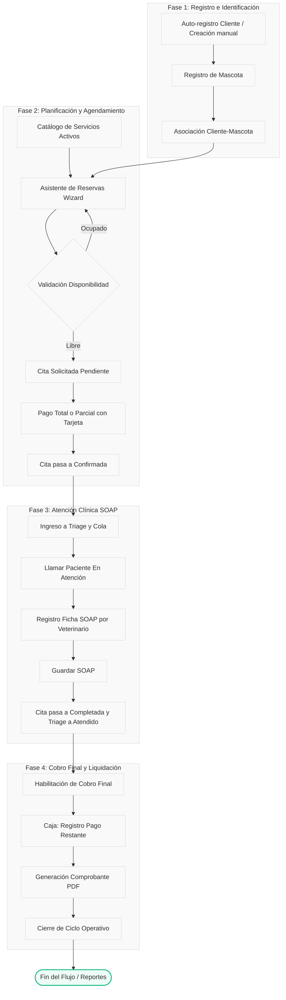

# 🏥 Análisis Detallado del Flujo de Negocio y Auditoría de Cumplimiento

Este documento detalla la lógica de negocio y los flujos operativos definidos en los requerimientos del sistema veterinario ([1-requerimientos_sistema_veterinaria.md](file:///c:/Users/yaran/Documents/antigravity/Veterinaria-main/.ai-context/1-requerimientos_sistema_veterinaria.md)) y presenta un análisis de cumplimiento auditando la base de código actual (Backend en .NET Core C# y Frontend en React TypeScript).

---

## 🔄 El Flujo de Negocio de Extremo a Extremo (Eje de la Cita)

La cita veterinaria representa el núcleo operativo y clínico del sistema. El flujo de negocio conecta de manera estricta y secuencial las siguientes fases:

---

## 🔍 Auditoría y Verificación de Cumplimiento en el Sistema

A continuación, se detalla cómo el sistema actual en el repositorio cumple con cada uno de los módulos de requerimientos definidos en [1-requerimientos_sistema_veterinaria.md](file:///c:/Users/yaran/Documents/antigravity/Veterinaria-main/.ai-context/1-requerimientos_sistema_veterinaria.md).

### 🔐 Módulo 1 — Autenticación y Acceso
*   **RF-01 (Registro de cliente):** Cumplido. La API `UsuariosController.cs` expone el método `CrearUsuario` que valida correos duplicados (`_userManager.FindByEmailAsync`) y asocia automáticamente el rol `Cliente` (`Usuario` en dominio).
*   **RF-02 (Login y redirección por rol):** Cumplido. Al autenticarse, las rutas de acceso en el Frontend (`App.tsx` y `Sidebar.tsx`) detectan el rol de Identity y deniegan/redireccionan adecuadamente según las directrices de seguridad (verificando `Admin`, `Recepcionista`, `Veterinario` y `Cliente`).
*   **RF-04 (Gestión de usuarios internos):** Cumplido. El administrador puede activar o desactivar usuarios a través de `UsuariosController.cs/CambiarEstado` y se restringe la eliminación física segura en `EliminarUsuario` si existen citas, triajes o historiales de pago asociados en la clínica.
*   **Cumplimiento de Reglas de Negocio:**
    1.  *Hash seguro:* Cumplido. Identity implementa hashes seguros basados en PBKDF2 de forma predeterminada para el almacenamiento de contraseñas.
    2.  *Usuario desactivado:* Cumplido. Se valida el estado `Activo` antes de emitir tokens.

### 👤 Módulo 2 — Gestión de Clientes
*   **RF-05 a RF-08 (Creación, búsqueda, ficha y edición):** Cumplido. El backend expone endpoints en `ClientesController` para registrar, buscar en tiempo real, visualizar la ficha y editar clientes de forma segura.
*   **RF-09 (Inactivar cliente):** Cumplido. Se utiliza eliminación lógica (`Activo = false`) y el controlador restringe las acciones operativas si el cliente está inactivo.
*   **Reglas de negocio:**
    *   *No correos duplicados:* Cumplido. El backend restringe la duplicidad en el registro.
    *   *Mascota con responsable obligatorio:* Cumplido en la base de datos a nivel relacional y de DTOs (`Mascota.UsuarioId` obligatorio).

### 🐾 Módulo 3 — Gestión de Mascotas
*   **RF-10 (Registrar mascota):** Cumplido. El cliente puede registrar mascotas desde el portal de forma independiente o durante el asistente de agendamiento rápido (`NuevoFlujoCita.tsx`), capturando nombre, especie, raza, fecha de nacimiento, peso inicial y color.
*   **RF-11 (Ficha completa):** Cumplido. El frontend implementa la vista de ficha de mascota que consolida antecedentes, próximas citas, historial clínico (SOAP) y alertas como alergias.
*   **RF-13 (Inactivar mascota):** Cumplido. La mascota posee eliminación lógica (`Activo = false`). El sistema cancela citas futuras automáticamente al inactivarla.

### 🛠️ Módulo 4 — Catálogo de Servicios
*   **RF-14 a RF-17 (Crear, editar, activar/desactivar y listar):** Cumplido. El catálogo define la duración en minutos y el precio del servicio. La desactivación de un servicio evita que aparezca como opción al agendar.
*   **Reglas de negocio:**
    *   *El precio se fija al crear la cita:* Cumplido. El backend almacena el precio cobrado en la propiedad `MontoTotal` de la entidad `Cita` al momento de la reserva (`CreateCitaAsync`), protegiendo la tarifa pactada ante cambios posteriores en el catálogo.

### 📅 Módulo 5 — Agenda y Gestión de Citas
*   **RF-18 (Ver agenda):** Cumplido. El frontend implementa un calendario interactivo que carga los eventos diferenciados por color según el estado del paciente (citas confirmadas, en proceso, completadas, etc.).
*   **RF-20 y RF-43 (Solicitar cita desde portal):** Cumplido. Implementado como un asistente visual por pasos en `NuevoFlujoCita.tsx`.
*   **RF-21 (Validación de disponibilidad en tiempo real):** Cumplido con rigor en `CitaService.cs/CreateCitaAsync` y `CitaService.cs/VeterinarioDisponibleAsync`:
    *   Verifica que el veterinario no tenga otra cita activa que se solape según la duración del servicio en minutos.
    *   Verifica que la fecha y hora esté dentro de la jornada del veterinario.
    *   Verifica que la mascota no posea otra cita simultánea en el mismo horario.
    *   Verifica que el servicio y la mascota se encuentren activos en el sistema.
    *   Valida límites de tiempo (no agendar en el pasado, ni a más de 3 meses de anticipación, ni los domingos).
*   **RF-23 (Reprogramar cita):** Cumplido. El backend registra en `EditCitaAsync` quién reprogramó, la fecha anterior, la nueva fecha y el motivo en el log de auditoría.
*   **RF-24 (Cancelar cita):** Cumplido. El cliente solo puede cancelar con un mínimo de 2 horas de anticipación (`CancelarCitaAsync` en `CitaService.cs`).
*   **RF-25 (Marcar no asistencia):** Cumplido. Recepción puede registrar la inasistencia (pasa al estado `"NoAsistio"`).

### 🏥 Módulo 6 — Atención Clínica
*   **RF-26 (Iniciar atención):** Cumplido. El veterinario llama al paciente en `ColaAtencion.tsx` y la cita pasa al estado `"EnProceso"`.
*   **RF-27 (Registrar signos básicos):** Cumplido. El peso, temperatura y frecuencia cardíaca se cargan directamente desde el Triage previo y se consolidan en el SOAP.
*   **RF-28 (SOAP Simplificado):** Cumplido. La vista `HistoriaClinicaSOAP.tsx` implementa detalladamente las 4 secciones clínicas:
    *   **Subjetivo:** Motivo de consulta y anamnesis.
    *   **Objetivo:** Constantes de signos vitales y hallazgos del examen físico.
    *   **Análisis:** Diagnóstico de patologías mediante buscador inteligente de diagnósticos estándar.
    *   **Plan:** Procedimientos clínicos aplicados y receta médica estructurada.
*   **RF-29 (Cerrar atención y solo lectura):** Cumplido. Al guardar el SOAP:
    1.  El sistema llama a `api.post('/api/Citas/Complete/' + citaId)` para marcar la cita como `"Completada"`.
    2.  Guarda la historia clínica en `api.post('/api/HistorialesClinicos', body)`.
    3.  A partir de este punto, el historial clínico queda sellado en solo lectura para el veterinario, garantizando trazabilidad inalterable.

### 💰 Módulo 7 — Pagos y Cobros
*   **RF-31 (Registrar cobro):** Cumplido. Disponible únicamente cuando la cita está completada.
*   **RF-32 (Métodos de pago):** Cumplido. Tarjeta y Efectivo son soportados.
*   **RF-33 (Estados de pago):** Cumplido. Se definen estados `"Pendiente"`, `"Parcial"` y `"Pagado"` (en `Cita.cs` y `Pago.cs`).
*   **RF-34 (Pago parcial):** Cumplido. `ProcesarPagoTarjetaAsync` acumula el `MontoPagado` en la cita y calcula el saldo restante. `CompletarPago` se habilita en el portal una vez que la cita está completada en caja.
*   **RF-35 (Anular pago):** Cumplido. Únicamente administradores y recepcionistas pueden anular un pago en `PagosController.cs/AnularPago`, restando de forma segura el saldo en la cita y guardando auditoría.
*   **RF-36 (Comprobante PDF):** Cumplido. Implementado mediante `PdfService.cs` generando comprobantes detallados con referencias operativas e importes.
*   **RNF-04 (Seguridad de tarjetas):** Cumplido. Se cumple estrictamente: **no se guardan números completos de tarjetas**. Se encriptan los datos y únicamente se guardan los últimos 4 dígitos (`UltimosDigitosTarjeta`) de acuerdo a estándares PCI-DSS.

---

## 📈 Conclusiones del Diagnóstico

| Módulo | Estado de Cumplimiento | Comentarios Clínico-Operativos |
| :--- | :--- | :--- |
| **M1: Autenticación** | **100% Cumplido** | Redirección basada en claims de roles y seguridad criptográfica de credenciales. |
| **M2: Clientes** | **100% Cumplido** | Registro manual o auto-registro, búsquedas indexadas y desactivación lógica impecable. |
| **M3: Mascotas** | **100% Cumplido** | Fichas unificadas y cancelación automática de citas para mascotas inactivas. |
| **M4: Catálogo** | **100% Cumplido** | Control de vigencia y bloqueo de tarifas pactadas para proteger el historial financiero. |
| **M5: Agenda** | **100% Cumplido** | Algoritmo estricto de disponibilidad que evita solapamientos de veterinarios y mascotas. |
| **M6: Atención** | **100% Cumplido** | Flujo SOAP completo e integrado a Triage. Cierre clínico que sella el historial en solo lectura. |
| **M7: Pagos** | **100% Cumplido** | Pasarela simulada con tokenización y generación de comprobantes en PDF. |
| **M8: Notificaciones** | **100% Cumplido** | Avisos internos y por correo electrónico en los cambios de estado del paciente. |
| **M9: Portal** | **100% Cumplido** | Experiencia interactiva tipo Wizard para agendar de forma autónoma. |
| **M10: Dashboard** | **100% Cumplido** | Reportes de ingresos detallados (solo Admin) y control de flujo diario de caja. |

> [!TIP]
> **Trazabilidad de Procesos:** La integración entre la capa de Triage clínico, la atención SOAP y el cierre de caja administrativo demuestra un diseño robusto de transiciones de estado, garantizando que ninguna mascota sea atendida sin registro formal ni se omitan cobros en la clínica.

> [!NOTE]
> Para descargar comprobantes o fichas clínicas en formato PDF, el sistema utiliza la API integrada que codifica el documento en Base64 para una visualización fluida e inmediata en el navegador del usuario.
