# 📘 Manual Completo de Flujos UML — Sistema de Gestión Veterinaria

Este documento contiene la especificación completa y el modelado visual de los procesos de negocio para el sistema de gestión de citas veterinarias. Todos los diagramas están estructurados utilizando la sintaxis oficial de **Mermaid**, listos para ser renderizados de forma nativa en entornos compatibles (como Obsidian, GitHub o Notion).

---

## 1. Visión general del sistema
Muestra el recorrido macro del negocio desde que un cliente o mascota entra al ecosistema hasta el cierre administrativo mediante el pago.

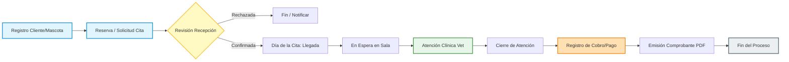

---

## 2. Flujo de autenticación y acceso
Regula la seguridad en el inicio de sesión, el hashing seguro de contraseñas y la redirección forzada según el rol del usuario asignado.

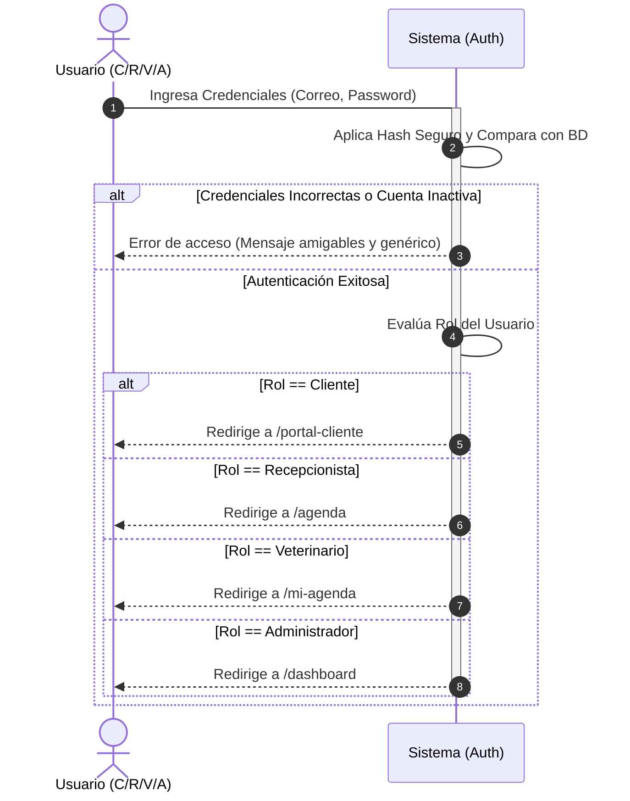

---

## 3. Flujo de registro de cliente y mascota
Muestra los caminos gemelos para el alta de cuentas: el auto-registro web por parte del cliente y el registro manual en recepción, incluyendo la verificación de duplicados.

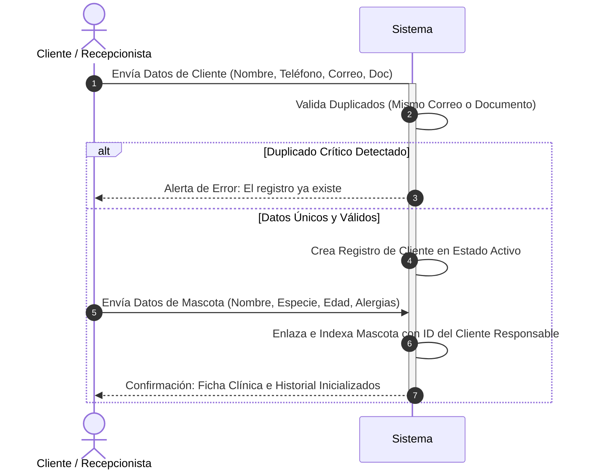

---

## 4. Flujo de solicitud de cita desde portal
Modelado del flujo de agendamiento autónomo por el cliente. Aplica la regla crítica de la reserva temporal de 5 minutos para congelar el bloque de tiempo.

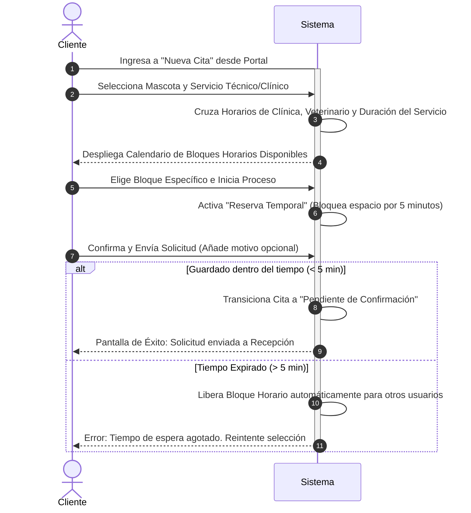

---

## 5. Flujo de gestión de cita por recepción
El panel operativo donde el personal evalúa las solicitudes entrantes, asigna veterinarios y procesa reprogramaciones válidas.

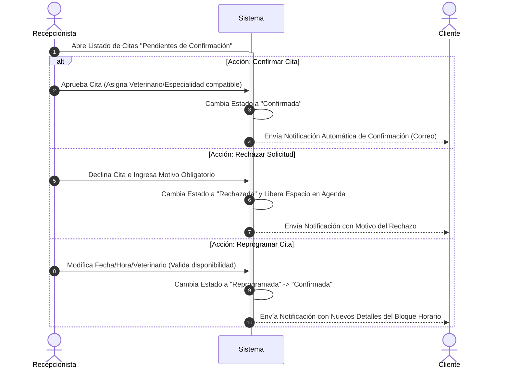

---

## 6. Ciclo de vida de una cita
Diagrama de estados exhaustivo que describe las transiciones válidas y restricciones lógicas que sufre la entidad Cita dentro de la base de datos.

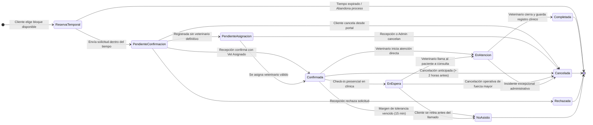

---

## 7. Flujo del día de la cita
Describe el protocolo físico y digital desde que el cliente pisa la clínica, pasando por el Check-in (En Espera) hasta que es llamado al box de consulta.

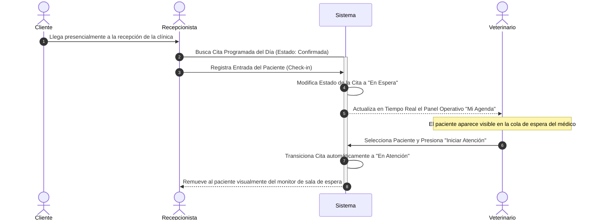

---

## 8. Flujo de atención clínica
La secuencia exclusiva del veterinario dentro del box médico. Restringe el historial a modo solo lectura una vez que la consulta ha sido cerrada de forma definitiva.

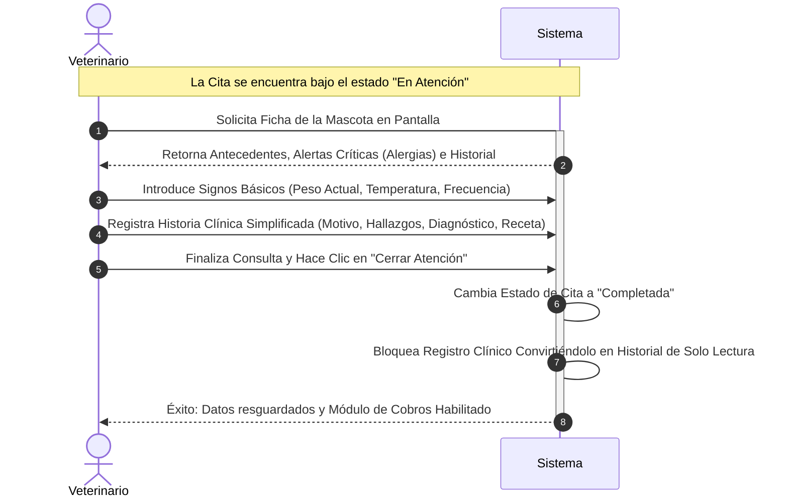

---

## 9. Flujo de pagos y cobros

Detalla el cierre administrativo de la atención. Permite registrar pagos totales, abonos parciales y la pista de auditoría obligatoria para anulaciones ejecutadas por el administrador.

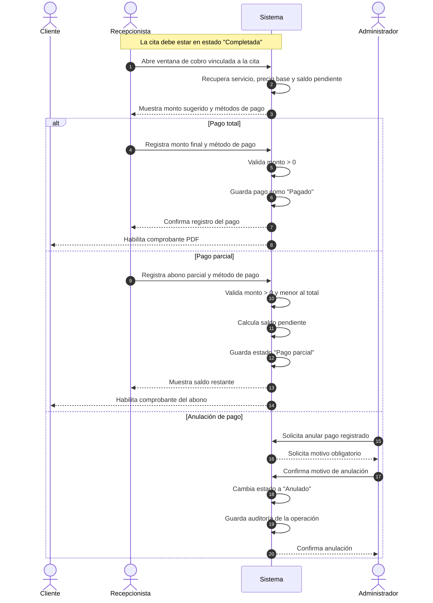
## 10. Flujo de cancelación y no asistencia

Aplica las políticas de cancelación permitida, cancelación operativa y control de inasistencia del cliente.

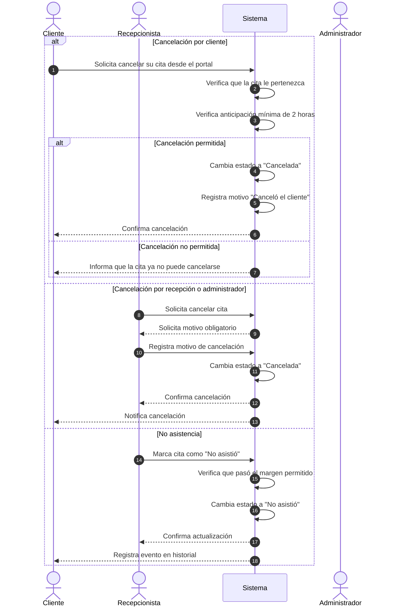

## 12. Flujos opcionales futuros
Estructura modular diseñada para escalar el núcleo de negocio en fases posteriores del desarrollo (Urgencias, Automatizaciones por Tareas Cron y Auditoría completa).

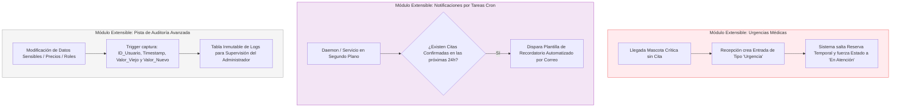
