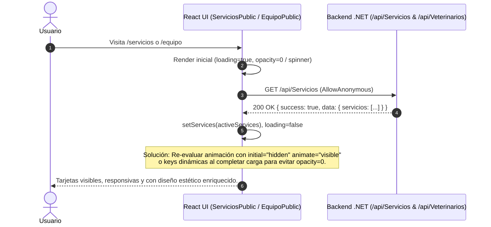

## Context

Actualmente en VetCare Pro, las vistas públicas (`LandingPage.tsx`, `ServiciosPublic.tsx`, `EquipoPublic.tsx`) fueron migradas recientemente para consultar de forma dinámica los endpoints `/api/Servicios` y `/api/Veterinarios`. Sin embargo, al renderizar en el navegador, las páginas de servicios (`/servicios`) y de equipo (`/equipo`) muestran únicamente el encabezado ("Servicios Especializados..." o "Conoce a Nuestros Especialistas...") con el área inferior completamente en blanco.

La causa raíz técnica se encuentra en dos aspectos:
1. **Carrera de Animación en Framer Motion**: Las secciones de la grilla (`<motion.section>`) utilizan `initial="hidden"`, `whileInView="visible"` y `viewport={{ once: true, margin: '-100px' }}`. Al cargar la página, el estado inicial es `loading = true`, mostrando el spinner en la grilla y disparando (o bloqueando) la animación del contenedor. Cuando la promesa de la API se resuelve (`setServices`/`setVets`) tras el render inicial, los nuevos elementos `<motion.div variants={cardVariants}>` montados dentro del contenedor no reciben el re-disparo de animación debido a `once: true` del padre o a que el `whileInView` del contenedor no propaga el estado `visible` a hijos montados asíncronamente en ese instante. Como resultado, las tarjetas permanecen de forma indefinida en `opacity: 0, y: 30`.
2. **Coherencia y Rediseño Visual**: El contenido mostrado en la página de inicio (`LandingPage.tsx`) y las páginas dedicadas debe reflejar fielmente las entidades reales de negocio (`Servicio` y `Veterinario`), con precios en soles (`S/`), duraciones exactas en minutos y los especialistas y especialidades reales de la clínica.

## Goals / Non-Goals

**Goals:**
- Solucionar de forma definitiva el renderizado en blanco/invisible de las tarjetas en `LandingPage.tsx`, `ServiciosPublic.tsx` y `EquipoPublic.tsx`.
- Rediseñar y refinar las tarjetas y secciones para que tengan un aspecto visual premium, claro, con tipografía robusta, animaciones fluidas que se ejecuten en el momento correcto y diseño responsivo.
- Garantizar que los servicios (`/api/Servicios`) y el equipo veterinario (`/api/Veterinarios`) se consuman y muestren con total fidelidad respecto al backend (`[AllowAnonymous]` verificado).

**Non-Goals:**
- Modificar la estructura de base de datos ni los DTOs internos del backend fuera de asegurar que el acceso público funcione correctamente.
- Alterar la lógica de autenticación o el portal privado (`/login`, `/portal-cliente`).

## Decisions

### Decisión 1: Estrategia de Animación Desacoplada para Carga Asíncrona en Framer Motion
- **Alternativa A (Seleccionada)**: Configurar la sección o contenedor para que cuando `loading` finalice, el contenedor renderice con `key={services.length}` o utilice `animate="visible"` (o `whileInView="visible"` sin márgenes negativos restrictivos como `-100px` que impiden activarse si el contenido es corto al inicio) sobre las tarjetas montadas asíncronamente, asegurando que las tarjetas transicionen de `hidden` a `visible` siempre al estar en pantalla.
- **Alternativa B**: Quitar por completo Framer Motion en las tarjetas dinámicas y usar solo CSS transitions. (Descartada porque queremos mantener la experiencia visual fluida y el diseño micro-animado solicitado en las directrices de diseño).

### Decisión 2: Enriquecimiento de Datos Visuales en Frontend via Helpers Mappers
- **Razón**: Los datos que vienen del backend (`Servicio` y `Veterinario`) contienen nombres, precios, duraciones y especialidades. Para ofrecer una estética moderna e inmersiva sin sobrecargar la base de datos con archivos de imagen, se utilizan mappers deterministas o por nombre (`getServiceImage`, `getServiceIcon`, `getVetImage`, `getVetIcon`, `getVetQuote`) que asignan iconos de Material Symbols y retratos profesionales de alta calidad.

## Risks / Trade-offs

- **[Risk] Margen de `viewport` en pantallas pequeñas/grandes** → *Mitigación*: Se cambiará el margen restrictivo `-100px` o se condicionará la animación al estado de carga (`!loading && animate="visible"` o `viewport={{ once: true, amount: 0.1 }}`), garantizando que en cualquier dispositivo móvil o de escritorio el contenido se muestre inmediatamente en cuanto los datos se reciben.
